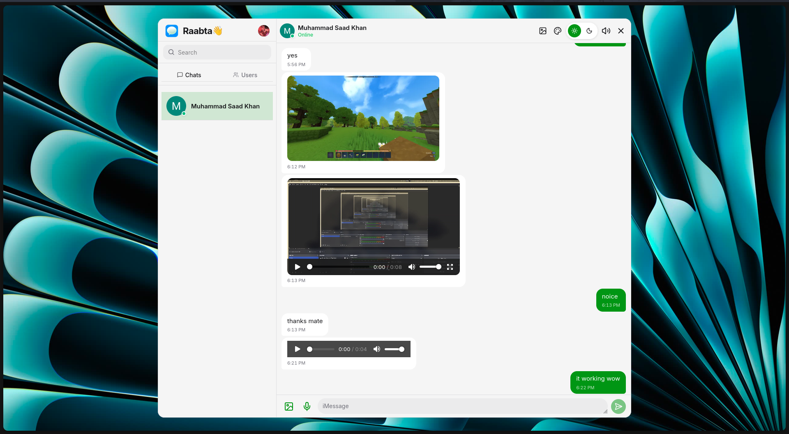

<p align="center">
  
</p>

<h1 align="center">Raabta</h1>

<p align="center">
  <strong>A modern, real-time messaging app.</strong>
  <br />
  <a href="https://raabta-mm3a.onrender.com/">Live Demo →</a>
</p>

<p align="center">
  
</p>

---

Raabta means *connection* — and that's exactly what it does. Chat instantly with anyone, share media, record voice notes, and make the space your own with accent themes, wallpapers, and dark mode.

## Features

| | |
|---|---|
| **Real-time messaging** | Instant delivery via Socket.io |
| **Voice notes** | Record and send audio right from the composer |
| **Media sharing** | Images and videos uploaded through ImageKit |
| **Theme presets** | 11 accent colors — Sky, Lavender, Mint, and more |
| **Dark mode** | Automatic light/dark with manual toggle |
| **Wallpaper picker** | 13 chat backdrops to personalize your space |
| **Authentication** | Powered by Clerk — Google, GitHub, email, and more |
| **Online presence** | Live online/offline indicators |
| **Sound effects** | Optional keyboard click sounds |
| **Responsive** | Works on desktop and mobile |

## Tech Stack

| | |
|---|---|
| **Frontend** | React 19, Vite 8, Tailwind CSS v4, HeroUI 3, Zustand 5 |
| **Backend** | Express 5, Mongoose 9, Socket.io 4 |
| **Auth** | Clerk (React SDK + Express SDK) |
| **Media** | ImageKit |
| **Database** | MongoDB |
| **Icons** | Lucide React |
| **Deployment** | Docker (3-stage monolith), Render |

## Getting Started

### Prerequisites

- Node.js 22+
- A MongoDB instance (Atlas free tier works)
- A [Clerk](https://clerk.com/) account
- An [ImageKit](https://imagekit.io/) account

### Clone

```bash
git clone https://github.com/yourusername/raabta.git
cd raabta
```

### Backend

```bash
cd backend
cp .env.example .env   # or create .env from scratch
```

Edit `backend/.env` with your keys:

```env
PORT=3000
MONGO_URI=mongodb+srv://<user>:<pass>@cluster.mongodb.net/raabta
CLERK_PUBLISHABLE_KEY=pk_live_...
CLERK_SECRET_KEY=sk_live_...
CLERK_WEBHOOK_SIGNING_SECRET=whsec_...
IMAGEKIT_PRIVATE_KEY=private_...
FRONTEND_URL=http://localhost:5173
NODE_ENV=development
```

```bash
npm install
npm run dev
```

The API starts at `http://localhost:3000`.

### Frontend

Open a second terminal:

```bash
cd frontend
```

Create `frontend/.env`:

```env
VITE_CLERK_PUBLISHABLE_KEY=pk_live_...
MODE=development
```

```bash
npm install
npm run dev
```

Open `http://localhost:5173` — you're in.

### Docker (Monolith)

```bash
docker build \
  --build-arg VITE_CLERK_PUBLISHABLE_KEY=$VITE_CLERK_PUBLISHABLE_KEY \
  -t raabta .

docker run -p 3001:3001 \
  -e MONGO_URI=$MONGO_URI \
  -e CLERK_SECRET_KEY=$CLERK_SECRET_KEY \
  -e CLERK_PUBLISHABLE_KEY=$CLERK_PUBLISHABLE_KEY \
  -e CLERK_WEBHOOK_SIGNING_SECRET=$CLERK_WEBHOOK_SIGNING_SECRET \
  -e IMAGEKIT_PRIVATE_KEY=$IMAGEKIT_PRIVATE_KEY \
  -e FRONTEND_URL=$FRONTEND_URL \
  raabta
```

## Environment Variables

### Backend

| Variable | Required | Default | Description |
|---|---|---|---|
| `PORT` | No | `3000` | Server port |
| `MONGO_URI` | Yes | — | MongoDB connection string |
| `CLERK_PUBLISHABLE_KEY` | Yes | — | Clerk publishable key |
| `CLERK_SECRET_KEY` | Yes | — | Clerk secret key |
| `CLERK_WEBHOOK_SIGNING_SECRET` | Yes | — | Clerk webhook secret |
| `IMAGEKIT_PRIVATE_KEY` | Yes | — | ImageKit private key |
| `FRONTEND_URL` | No | `http://localhost:5173` | CORS origin |
| `NODE_ENV` | No | — | `development` or `production` |

### Frontend

| Variable | Required | Description |
|---|---|---|
| `VITE_CLERK_PUBLISHABLE_KEY` | Yes | Clerk publishable key (same as backend) |
| `MODE` | No | `development` or `production` |

## Project Structure

```
raabta/
├── backend/
│   ├── src/
│   │   ├── controllers/       # Route handlers
│   │   ├── lib/               # DB, socket, ImageKit, cron
│   │   ├── middleware/         # Auth guard, file upload
│   │   ├── models/            # Mongoose schemas
│   │   ├── routes/            # Express routers
│   │   ├── webhooks/          # Clerk webhook handler
│   │   └── index.js           # Entry point
│   └── package.json
├── frontend/
│   ├── public/                # Static assets
│   ├── src/
│   │   ├── components/        # React UI components
│   │   │   ├── auth/          # Auth page pieces
│   │   │   └── chat/          # Chat interface pieces
│   │   ├── context/           # Theme & wallpaper providers
│   │   ├── data/              # Theme presets & wallpaper definitions
│   │   ├── hooks/             # Custom React hooks
│   │   ├── lib/               # Axios, ImageKit client, utilities
│   │   ├── pages/             # AuthPage, ChatPage
│   │   ├── store/             # Zustand stores
│   │   ├── styles/            # CSS theme presets
│   │   ├── App.jsx
│   │   ├── main.jsx
│   │   └── index.css
│   └── package.json
├── docs/
│   └── app_screenshot.png
├── Dockerfile                 # 3-stage monolith build
└── README.md
```

## Scripts

### Backend

| Script | Command | Description |
|---|---|---|
| `dev` | `node --watch src/index.js` | Dev server with auto-restart |
| `start` | `node src/index.js` | Production start |
| `build` | `cp -R src dist` | Bundle for deployment |

### Frontend

| Script | Command | Description |
|---|---|---|
| `dev` | `vite` | Dev server with HMR |
| `build` | `vite build` | Production build |
| `preview` | `vite preview` | Preview production build |
| `lint` | `oxlint` | Run linter |

## Deployment

The app ships as a single Docker container. The Dockerfile uses a 3-stage build:

1. **frontend-build** — builds the Vite SPA
2. **backend-build** — prepares the Express source
3. **runner** — minimal runtime with production dependencies + both artifacts

Express serves the SPA's static files from `./public` in production. Designed for Render or any container platform.

## About the Name

Raabta (राब्ता) is a Hindi/Urdu word meaning *connection* or *relationship*.
